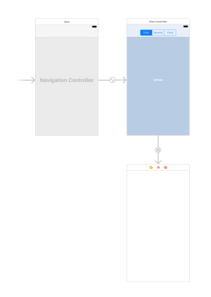
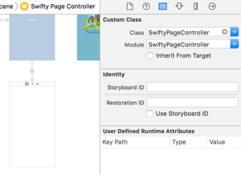

# SwiftyPageController

[](https://travis-ci.org/alkhokhlov/SwiftyPageController)
[](http://cocoapods.org/pods/SwiftyPageController)
[](http://cocoapods.org/pods/SwiftyPageController)
[](http://cocoapods.org/pods/SwiftyPageController)


## Description

**SwiftyPageController** will be helpful to use in many pages controller.

Advantages:
 - **customizable** animation transition;
 - **customizable** selecting buttons (you can implement them by your own)

## How to use

 - Add **Contanier View** from storyboard or programmatically



 - Choose class for container controller **SwiftyPageController**



 - Setup like example below

```swift
class ViewController: UIViewController {

    @IBOutlet weak var segmentControl: UISegmentedControl!
    
    var containerController: SwiftyPageController!
    
    override func viewDidLoad() {
        super.viewDidLoad()
        segmentControl.addTarget(self, action: #selector(segmentControlDidChange(_:)), for: .valueChanged)
    }
    
    func segmentControlDidChange(_ sender: UISegmentedControl) {
        // select needed controller
        containerController.selectController(atIndex: sender.selectedSegmentIndex, animated: true)
    }
    
    func setupContainerController(_ controller: SwiftyPageController) {
        // assign variable
        containerController = controller
        
        // set delegate
        containerController.delegate = self
        
        // set animation type
        containerController.animator = .parallax
        
        // set view controllers
        let firstController = UIStoryboard(name: "Main", bundle: nil).instantiateViewController(withIdentifier: "\(FirstViewController.self)")
        let secondController = UIStoryboard(name: "Main", bundle: nil).instantiateViewController(withIdentifier: "\(SecondViewController.self)")
        let thirdController = UIStoryboard(name: "Main", bundle: nil).instantiateViewController(withIdentifier: "\(ThirdViewController.self)")
        containerController.viewControllers = [firstController, secondController, thirdController]
        
        // select needed controller
        containerController.selectController(atIndex: 0, animated: false)
    }
    
    // MARK: - Navigation

    override func prepare(for segue: UIStoryboardSegue, sender: Any?) {
        if let containerController = segue.destination as? SwiftyPageController {
            setupContainerController(containerController)
        }
    }

}
```

 - In _ViewController_ where you added container controller implement **SwiftyPageControllerDelegate**

```swift
func swiftyPageController(_ controller: SwiftyPageController, alongSideTransitionToController toController: UIViewController) {
        
    }
    
    func swiftyPageController(_ controller: SwiftyPageController, didMoveToController toController: UIViewController) {
        segmentControl.selectedSegmentIndex = containerController.viewControllers.index(of: toController)!
    }
    
    func swiftyPageController(_ controller: SwiftyPageController, willMoveToController toController: UIViewController) {
        
    }
```

 - For selecting needed tab use method 

```swift
 func selectController(atIndex index: Int, animated: Bool)
```

## Animation


To choose animation use property

```swift
public var animator: AnimatorType
```

You can use three types of animation:
 - default
 - parallax
 - custom

 If you want to create own animation you need to implement **SwiftyPageControllerAnimatorProtocol**. 

```swift
public protocol SwiftyPageControllerAnimatorProtocol {
    
    var animationDuration: TimeInterval { get }
    
    var animationProgress: Float { get set }
    
    var animationSpeed: Float { get set }
    
    func setupAnimation(fromController: UIViewController, toController: UIViewController, panGesture: UIPanGestureRecognizer, animationDirection: SwiftyPageController.AnimationDirection)
    
    func didFinishAnimation(fromController: UIViewController, toController: UIViewController)
    
}
```

 And use it like that:

```swift
containerController.animator = .custom(CustomAnimationController())
```

## Example

To run the example project, clone the repo, and run `pod install` from the Example directory first.

## Requirements

## Installation

SwiftyPageController is available through [CocoaPods](http://cocoapods.org). To install
it, simply add the following line to your Podfile:

```ruby
pod "SwiftyPageController"
```

## Author

alkhokhlov, alkhokhlovv@gmail.com

## License

SwiftyPageController is available under the MIT license. See the LICENSE file for more info.
